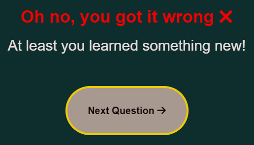

# Kieran's Car Quiz - KCQ

Kieran's Car Quiz is a fun, responsive car quiz that is designed to both engage and interact with the user. The site was designed to demonstrate a variety of different JavaScript functions.

## Live Site Link

https://kc-7.github.io/car-quiz/

## Technologies

The following technologies were used to develop this site: 

- **HTML** - is used to structure the website. 

- **CSS** - is used to style the website. 

- **JavaScript** - is used to make the website interactive. 

- **Google Fonts** - is used to import additional fonts. 

- **Font Awesome V5 Icons** - is used to import icons. 

- **GitPod** - is the platform used to develop the site. 

- **GitHub** - is used to host the website. 

## Features

- The user is greeted by a streamline quiz home page.

- There is a header bar located at the top of the page that displays a logo, header text and score bar. 

- The header text is not displayed on smaller devices and the logo is changed to an alternative design. 

- There is a collapsible window below the header bar.

- When the user expands the collabsible window, they are presented with text relating to the quiz and the CSS validation link. 

- If the user is on a device with a larger screen width, a QR code will be displayed to give them the option to try the quiz on a mobile device. 

- The collapsible window button text is adjusted when the div is opened / closed to prompt the user to utilize the function. 

- The user is able to start the quiz by pressing the "Engine Start" button. 

- The question is then displayed alongside the potential answers. The number of options and order of questions varies. 

- When the user selects an option, there score is updated and displayed in the right hand side of the header bar. 

- The site will scroll down to the next button if required so the user knows theirs is more content on the page, it srolls back up to the top of the page when going to the next question.

- The incorrect options are displayed in red and the correct answers in green. 

- The background colour of the body is changed to dark green or dark red depending on if the user answered correctly. 

- The user is alerted below the question options to wether they have answered correctly or not. 

- The text is set to change at random based on a preset array for both the correct and incorrect answers. 

- The next question button is displayed and when clicked it brings the user to the next question which is chosen at random. 

- When the user completes the array of questions, they will be alerted that they have made it to the end of the quiz after the section displaying their final result. 

- The start button is then displayed with the text "Try Again" and when selected will reset the score counters and the question index back to the start. 

- The footer is displayed at the end of the web page. It is static on larger devices but is set to stay in line with the web page instead of the broswer window on smaller devices. 

- Media queries were used for responsive design so that the site is aesthically pleasing on a variety of different device sizes.

- A favicon is utilized to display the site's alt logo in the broswer tab. 

### Features Left to Implement

- A submit button could be displayed after the user selects their option, this would give then the option to change their option is they selected the wrong button by mistake before their choice is submitted. When they click submit, the button would then be replaced with the next button. This would give the user an oppurtunity to review their score before proceeding to the next question. 

- Additional difficulty levels could be set up asking the user an array of more difficult questions. 

- A timer feature could be implemented. 

- Sounds could be utilized for user feedback. 

- Add additional pages such as contact, 404, etc. 

## Design

- The site was designed to demonstrate a variety of different JavaScript, CSS and HTML techniques. 

- Basic sketches and flow charts were created prior to coding. 

- The JavaScript is set to function in a set order. Certain elements are set to randomize to provide a unique user eqperience. 

- The site was designed using the below colour scheme: 

- The site's main and alternative logos were created to enchance the sites appearance and create a professional UI. 

## Testing 

XXXXXXXXXXXXXXXXXXXXXXXXXXXXXXXXXXXXXXXXXX

#### HTML - W3C Validator

#### CSS - Jigsaw Validator

#### JS - JSHint Validator

#### Google Inpsect - Check HTML, CSS & JS. Utilzed console.logs when developing and testing. Lighthouse reports. 

- I used console.log()'s during development and testing to ensure all functions were being called correctly. These were removed once testing was completed.  

- I analyzed the page load on both mobile and desktop devices using the Google Inspect Lighthouse Report Feature and received full marks for all criteria; Performance, Accessibility, Best Practices and SEO. 

#### Responsive Design & Visual Testing - Google Inspect & AmIResponsive

- Visual testing was mainly carried out using the Google Chrome Inspect tool. I tested all sections of the site on a combination of different screen sizes. 

- I carried out visual testing on the following device sizes using Google Inspect: 
    - iPhone SE: 375 x 667 px
    - iPhone XR: 414 x 896 px
    - iPhone 12 Pro 390 x 844 px
    - Pixel 5: 393 x 851 px
    - Samsung Galaxy S8+: 360 x 740 px
    - Samsung Galaxy S20 Ultra: 412 x 915 px
    - iPad Air: 820 x 1180 px
    - iPad Mini: 768 x 1024 px
    - Surface Pro 7: 912 x 1368 px
    - Galaxy Fold: 280 x 653 px - *Note, this is the smallest device size the site has been designed to operate on*
    - Nest Hub: 1024 x 600 px
    - Nest Hub Max: 1280 x 800 px

- Visual testing was also carried out using <a href="https://ui.dev/amiresponsive" target="_blank" rel="noopener" aria-label="Link to Am I Responsive Website (opens in new tab)">Am I Responsive</a>. The responsive image examples shown above were taken from this website. This site provides simulations in the following sizes: 
    - Desktop: 1600 x 992 px - scaled down to scale (0.3181)
    - Laptop: 1280 x 802 px - scaled down to scale (0.277)
    - Tablet: 768 x 1024 px - scaled down to scale (0.219)
    - Mobile: 320 x 480 px - scaled down to scale (0.219)

- I physically tested the site on the following devices: 
    - Dell Monitor - 24": 1920 x 1200 px
    - Lenovo Yoga 910 - 14" (4k): 3840 x 2160 px
    - Samsung Galaxy S10 - 5.8": 360 x 760 px

#### Fixed Bugs

XXXXXXXXXXXXXXXXXXXXXXXXXXXXXXXXXXXXXXXXXX

### Unfixed Bugs

I was not able to identify any further bugs during final testing. 

## Deployment

### GitPod

- I developed the site using HTML and CSS in GitPod. 

- I ran a local sever each time I was viewing & editing it by typing the below into the terminal: 
    - *python3 -m http.server*

- For version control, I regularly updated my work to GitHub by entering the below commands into the terminal: 
    - *git add .*
    - *git commit -m "Update message here"*
    - *git push*

### GitHub

The site was deployed using <a href="https://github.com/KC-7/car-quiz" target="_blank" rel="noopener" aria-label="Link to the GitHub Repo (opens in new tab)">GitHub</a> pages:
- In the GitHub repository, navigate to the Settings tab.
- From the source section drop-down menu, select the Master Branch.
- Once the master/main branch has been selected, you will then see your link to your site. 
- The live link can be found here: https://kc-7.github.io/car-quiz/ 

## Credits

### Content

- This site was developed using information learned from the <a href="https://codeinstitute.net/" target="_blank" rel="noopener" aria-label="Link to the Code Institute (opens in new tab)">Code Institute</a> alongside other online resources such as <a href="https://www.w3schools.com/" target="_blank" rel="noopener" aria-label="Link to W3Schools (opens in new tab)">W3Schools</a> & <a href="https://stackoverflow.com/" target="_blank" rel="noopener" aria-label="Link to Stack Overflow (opens in new tab)">Stack Overflow</a>. 

- The Code Institute's Gitpod Full Template was used as the initial template for the project. The repository is available on their <a href="https://github.com/Code-Institute-Org/gitpod-full-template" target="_blank" rel="noopener" aria-label="Link to The Code Institute Gitpod Full Template (opens in new tab)">GitHub Account</a>. 

- I learned how to implement the Favicon, the picture in the browser tab, from using <a href="https://www.w3schools.com/html/html_favicon.asp" target="_blank" rel="noopener" aria-label="Link to W3Schools' Favicon Guide (opens in new tab)">W3Schools</a> guide on implementing this feature.

- I learned how to implement the smooth scroll function, the effect that scrolls down to the area being navigated to instead of jumping to it, from using <a href="https://www.w3schools.com/howto/howto_css_smooth_scroll.asp" target="_blank" rel="noopener" aria-label="Link to W3Schools' Smooth Scroll Guide (opens in new tab)">W3Schools</a> guide on implementing this feature.

- The social links, app download sections and the CSS validator logo all contain links to third party websites. 

- Fonts added using <a href="https://fonts.google.com/" target="_blank" rel="noopener" aria-label="Link to Google Fonts (opens in new tab)">Google Fonts</a>.

- Icons added using <a href="https://fonts.google.com/" target="_blank" rel="noopener" aria-label="Link to Font Awesome | Free V5 Icons (opens in new tab)">Font Awesome | Free V5 Icons</a>.

- The resposive images in the README file above were taken from <a href="https://ui.dev/amiresponsive" target="_blank" rel="noopener" aria-label="Link to Am I Responsive Website (opens in new tab)">Am I Responsive</a>.

- The QR Code was created for free using https://www.qr-code-generator.com/

- The colour platte was generated using https://coolors.co/ . 

### Media 

- The site logo was created using the <a href="https://express.adobe.com/express-apps/logo-maker/" target="_blank" rel="noopener" aria-label="Link to Adobe Express | Free Logo Maker (opens in new tab)">Adobe Express | Logo Maker</a>.

Thanks For reading! 😃

_________________________________________________________________________________________________________________________________________________________________________________

